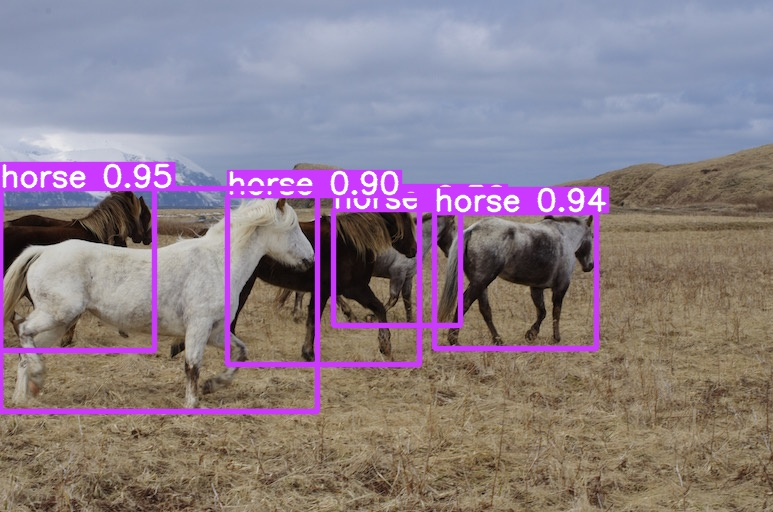

# Project Name: Computer Vision based Object Detection & Classification
This project focuses on real-time object detection and classification using deep learning models trained on the COCO (Common Objects in Context) dataset. By leveraging state-of-the-art architectures such as YOLO (You Only Look Once), Faster R-CNN, and SSD (Single Shot MultiBox Detector), the system identifies and classifies multiple objects in images and videos with high accuracy. The project also incorporates bounding box annotations and confidence scores to enhance interpretability. Potential applications include autonomous driving, smart surveillance, and augmented reality.


<div align="center">
    <a href="./">
        
    </a>
</div>


## Performance 

MS COCO

| Model | Test Size | AP<sup>val</sup> | AP<sub>50</sub><sup>val</sup> | AP<sub>75</sub><sup>val</sup> | Param. | FLOPs |
| :-- | :-: | :-: | :-: | :-: | :-: | :-: |
| [**YOLOv9-T**](https://github.com/WongKinYiu/yolov9/releases/download/v0.1/yolov9-t-converted.pt) | 640 | **38.3%** | **53.1%** | **41.3%** | **2.0M** | **7.7G** |
| [**YOLOv9-S**](https://github.com/WongKinYiu/yolov9/releases/download/v0.1/yolov9-s-converted.pt) | 640 | **46.8%** | **63.4%** | **50.7%** | **7.1M** | **26.4G** |
| [**YOLOv9-M**](https://github.com/WongKinYiu/yolov9/releases/download/v0.1/yolov9-m-converted.pt) | 640 | **51.4%** | **68.1%** | **56.1%** | **20.0M** | **76.3G** |
| [**YOLOv9-C**](https://github.com/WongKinYiu/yolov9/releases/download/v0.1/yolov9-c-converted.pt) | 640 | **53.0%** | **70.2%** | **57.8%** | **25.3M** | **102.1G** |
| [**YOLOv9-E**](https://github.com/WongKinYiu/yolov9/releases/download/v0.1/yolov9-e-converted.pt) | 640 | **55.6%** | **72.8%** | **60.6%** | **57.3M** | **189.0G** |
<!-- | [**YOLOv9 (ReLU)**]() | 640 | **51.9%** | **69.1%** | **56.5%** | **25.3M** | **102.1G** | -->

<!-- tiny, small, and medium models will be released after the paper be accepted and published. -->


## Installation

Docker environment (recommended)
<details><summary> <b>Expand</b> </summary>

``` shell
# create the docker container, you can change the share memory size if you have more.
nvidia-docker run --name yolov9 -it -v your_coco_path/:/coco/ -v your_code_path/:/yolov9 --shm-size=64g nvcr.io/nvidia/pytorch:21.11-py3

# apt install required packages
apt update
apt install -y zip htop screen libgl1-mesa-glx

# pip install required packages
pip install seaborn thop

# go to code folder
cd /yolov9
```

</details>


## Evaluation

[`yolov9-s-converted.pt`](https://github.com/rahulkulkarny/yolov9/releases/download/v0.1/yolov9-s-converted.pt) [`yolov9-m-converted.pt`](https://github.com/rahulkulkarny/yolov9/releases/download/v0.1/yolov9-m-converted.pt) [`yolov9-c-converted.pt`](https://github.com/rahulkulkarny/yolov9/releases/download/v0.1/yolov9-c-converted.pt) [`yolov9-e-converted.pt`](https://github.com/rahulkulkarny/yolov9/releases/download/v0.1/yolov9-e-converted.pt) 
[`yolov9-s.pt`](https://github.com/rahulkulkarny/yolov9/releases/download/v0.1/yolov9-s.pt) [`yolov9-m.pt`](https://github.com/rahulkulkarny/yolov9/releases/download/v0.1/yolov9-m.pt) [`yolov9-c.pt`](https://github.com/rahulkulkarny/yolov9/releases/download/v0.1/yolov9-c.pt) [`yolov9-e.pt`](https://github.com/rahulkulkarny/yolov9/releases/download/v0.1/yolov9-e.pt) 
[`gelan-s.pt`](https://github.com/rahulkulkarny/yolov9/releases/download/v0.1/gelan-s.pt) [`gelan-m.pt`](https://github.com/rahulkulkarny/yolov9/releases/download/v0.1/gelan-m.pt) [`gelan-c.pt`](https://github.com/rahulkulkarny/yolov9/releases/download/v0.1/gelan-c.pt) [`gelan-e.pt`](https://github.com/rahulkulkarny/yolov9/releases/download/v0.1/gelan-e.pt)

``` shell
# evaluate converted yolov9 models
python val.py --data data/coco.yaml --img 640 --batch 32 --conf 0.001 --iou 0.7 --device 0 --weights './yolov9-c-converted.pt' --save-json --name yolov9_c_c_640_val

# evaluate yolov9 models
# python val_dual.py --data data/coco.yaml --img 640 --batch 32 --conf 0.001 --iou 0.7 --device 0 --weights './yolov9-c.pt' --save-json --name yolov9_c_640_val

# evaluate gelan models
# python val.py --data data/coco.yaml --img 640 --batch 32 --conf 0.001 --iou 0.7 --device 0 --weights './gelan-c.pt' --save-json --name gelan_c_640_val
```

You will get the results:

```
 Average Precision  (AP) @[ IoU=0.50:0.95 | area=   all | maxDets=100 ] = 0.530
 Average Precision  (AP) @[ IoU=0.50      | area=   all | maxDets=100 ] = 0.702
 Average Precision  (AP) @[ IoU=0.75      | area=   all | maxDets=100 ] = 0.578
 Average Precision  (AP) @[ IoU=0.50:0.95 | area= small | maxDets=100 ] = 0.362
 Average Precision  (AP) @[ IoU=0.50:0.95 | area=medium | maxDets=100 ] = 0.585
 Average Precision  (AP) @[ IoU=0.50:0.95 | area= large | maxDets=100 ] = 0.693
 Average Recall     (AR) @[ IoU=0.50:0.95 | area=   all | maxDets=  1 ] = 0.392
 Average Recall     (AR) @[ IoU=0.50:0.95 | area=   all | maxDets= 10 ] = 0.652
 Average Recall     (AR) @[ IoU=0.50:0.95 | area=   all | maxDets=100 ] = 0.702
 Average Recall     (AR) @[ IoU=0.50:0.95 | area= small | maxDets=100 ] = 0.541
 Average Recall     (AR) @[ IoU=0.50:0.95 | area=medium | maxDets=100 ] = 0.760
 Average Recall     (AR) @[ IoU=0.50:0.95 | area= large | maxDets=100 ] = 0.844
```


## Training

Data preparation

``` shell
bash scripts/get_coco.sh
```

* Download MS COCO dataset images ([train](http://images.cocodataset.org/zips/train2017.zip), [val](http://images.cocodataset.org/zips/val2017.zip), [test](http://images.cocodataset.org/zips/test2017.zip)) and [labels](https://github.com/rahulkulkarny/yolov7/releases/download/v0.1/coco2017labels-segments.zip). If you have previously used a different version of YOLO, it is strongly recommended that you delete `train2017.cache` and `val2017.cache` files, and redownload [labels](https://github.com/rahulkulkarny/yolov7/releases/download/v0.1/coco2017labels-segments.zip) 

Single GPU training

``` shell
# train yolov9 models
python train_dual.py --workers 8 --device 0 --batch 16 --data data/coco.yaml --img 640 --cfg models/detect/yolov9-c.yaml --weights '' --name yolov9-c --hyp hyp.scratch-high.yaml --min-items 0 --epochs 500 --close-mosaic 15

# train gelan models
# python train.py --workers 8 --device 0 --batch 32 --data data/coco.yaml --img 640 --cfg models/detect/gelan-c.yaml --weights '' --name gelan-c --hyp hyp.scratch-high.yaml --min-items 0 --epochs 500 --close-mosaic 15
```

Multiple GPU training

``` shell
# train yolov9 models
python -m torch.distributed.launch --nproc_per_node 8 --master_port 9527 train_dual.py --workers 8 --device 0,1,2,3,4,5,6,7 --sync-bn --batch 128 --data data/coco.yaml --img 640 --cfg models/detect/yolov9-c.yaml --weights '' --name yolov9-c --hyp hyp.scratch-high.yaml --min-items 0 --epochs 500 --close-mosaic 15

# train gelan models
# python -m torch.distributed.launch --nproc_per_node 4 --master_port 9527 train.py --workers 8 --device 0,1,2,3 --sync-bn --batch 128 --data data/coco.yaml --img 640 --cfg models/detect/gelan-c.yaml --weights '' --name gelan-c --hyp hyp.scratch-high.yaml --min-items 0 --epochs 500 --close-mosaic 15
```


## Inference

<div align="center">
    <a href="./">
        
    </a>
</div>

``` shell
# inference converted yolov9 models
python detect.py --source './data/images/horses.jpg' --img 640 --device 0 --weights './yolov9-c-converted.pt' --name yolov9_c_c_640_detect

# inference yolov9 models
# python detect_dual.py --source './data/images/horses.jpg' --img 640 --device 0 --weights './yolov9-c.pt' --name yolov9_c_640_detect

# inference gelan models
# python detect.py --source './data/images/horses.jpg' --img 640 --device 0 --weights './gelan-c.pt' --name gelan_c_c_640_detect
```


#### Object Detection

`object recognition`

``` shell
# coco/labels/{split}/*.txt
# bbox or polygon (1 instance 1 line)
python train.py --workers 8 --device 0 --batch 32 --data data/coco.yaml --img 640 --cfg models/detect/gelan-c.yaml --weights '' --name gelan-c-det --hyp hyp.scratch-high.yaml --min-items 0 --epochs 300 --close-mosaic 10
```

| Model | Test Size | Param. | FLOPs | AP<sup>box</sup> |
| :-- | :-: | :-: | :-: | :-: |
| [**GELAN-C-DET**](https://github.com/rahulkulkarny/yolov9/releases/download/v0.1/gelan-c-det.pt) | 640 | 25.3M | 102.1G |**52.3%** |
| [**YOLOv9-C-DET**]() | 640 | 25.3M | 102.1G | **53.0%** |

#### Instance Segmentation

[`gelan-c-seg.pt`](https://github.com/rahulkulkarny/yolov9/releases/download/v0.1/gelan-c-seg.pt)

`object detection` `instance segmentation`

``` shell
# coco/labels/{split}/*.txt
# polygon (1 instance 1 line)
python segment/train.py --workers 8 --device 0 --batch 32  --data coco.yaml --img 640 --cfg models/segment/gelan-c-seg.yaml --weights '' --name gelan-c-seg --hyp hyp.scratch-high.yaml --no-overlap --epochs 300 --close-mosaic 10
```

| Model | Test Size | Param. | FLOPs | AP<sup>box</sup> | AP<sup>mask</sup>  |
| :-- | :-: | :-: | :-: | :-: | :-: |
| [**GELAN-C-SEG**](https://github.com/rahulkulkarny/yolov9/releases/download/v0.1/gelan-c-seg.pt) | 640 | 27.4M | 144.6G | **52.3%** | **42.4%** |
| [**YOLOv9-C-SEG**]() | 640 | 27.4M | 145.5G | **53.3%** | **43.5%** |

#### Panoptic Segmentation

[`gelan-c-pan.pt`](https://github.com/rahulkulkarny/yolov9/releases/download/v0.1/gelan-c-pan.pt)

`object detection` `instance segmentation` `semantic segmentation` `stuff segmentation` `panoptic segmentation`

``` shell
# coco/labels/{split}/*.txt
# polygon (1 instance 1 line)
# coco/stuff/{split}/*.txt
# polygon (1 semantic 1 line)
python panoptic/train.py --workers 8 --device 0 --batch 32  --data coco.yaml --img 640 --cfg models/panoptic/gelan-c-pan.yaml --weights '' --name gelan-c-pan --hyp hyp.scratch-high.yaml --no-overlap --epochs 300 --close-mosaic 10
```

| Model | Test Size | Param. | FLOPs | AP<sup>box</sup> | AP<sup>mask</sup>  | mIoU<sub>164k/10k</sub><sup>semantic</sup> | mIoU<sup>stuff</sup> | PQ<sup>panoptic</sup> |
| :-- | :-: | :-: | :-: | :-: | :-: | :-: | :-: | :-: |
| [**GELAN-C-PAN**](https://github.com/rahulkulkarny/yolov9/releases/download/v0.1/gelan-c-pan.pt) | 640 | 27.6M | 146.7G | **52.6%** | **42.5%** | **39.0%/48.3%** | **52.7%** | **39.4%** |
| [**YOLOv9-C-PAN**]() | 640 | 28.8M | 187.0G | **52.7%** | **43.0%** | **39.8%/-** | **52.2%** | **40.5%** |

#### Image Captioning (not yet released)

<!--[`gelan-c-cap.pt`]()-->

`object detection` `instance segmentation` `semantic segmentation` `stuff segmentation` `panoptic segmentation` `image captioning`

``` shell
# coco/labels/{split}/*.txt
# polygon (1 instance 1 line)
# coco/stuff/{split}/*.txt
# polygon (1 semantic 1 line)
# coco/annotations/*.json
# json (1 split 1 file)
python caption/train.py --workers 8 --device 0 --batch 32  --data coco.yaml --img 640 --cfg models/caption/gelan-c-cap.yaml --weights '' --name gelan-c-cap --hyp hyp.scratch-high.yaml --no-overlap --epochs 300 --close-mosaic 10
```

| Model | Test Size | Param. | FLOPs |  AP<sup>box</sup> | AP<sup>mask</sup>  | mIoU<sub>164k/10k</sub><sup>semantic</sup>  | mIoU<sup>stuff</sup> | PQ<sup>panoptic</sup> | BLEU@4<sup>caption</sup> | CIDEr<sup>caption</sup> |
| :-- | :-: | :-: | :-: | :-: | :-: | :-: | :-: | :-: | :-: | :-: |
| [**GELAN-C-CAP**]() | 640 | 47.5M | - | **51.9%** | **42.6%** | **42.5%/-** | **56.5%** | **41.7%** | **38.8** | **122.3** |
| [**YOLOv9-C-CAP**]() | 640 | 47.5M | - | **52.1%** | **42.6%** | **43.0%/-** | **56.4%** | **42.1%** | **39.1** | **122.0** |
<!--| [**YOLOR-MT**]() | 640 | 79.3M | - | **51.0%** | **41.7%** | **-/49.6%** | **55.9%** | **40.5%** | **35.7** | **112.7** |-->


</details>
